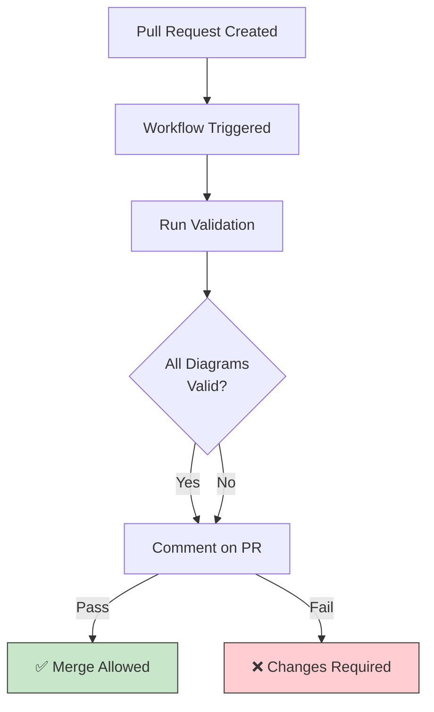

# Mermaid Validation Setup Guide

This document explains the automated Mermaid diagram validation system for this repository.

## Overview

The repository includes a GitHub Actions workflow that automatically validates all Mermaid diagrams to ensure they render correctly on GitHub. This prevents syntax errors from being merged and maintains diagram quality.

## Components

### 1. GitHub Actions Workflow
**Location**: `.github/workflows/validate-mermaid.yml`

**Features**:
- ✅ Runs on pull requests and pushes to main
- ✅ Validates Mermaid syntax using mermaid-cli
- ✅ Checks for common GitHub rendering issues
- ✅ Generates validation reports
- ✅ Comments on PRs with results
- ✅ Caches dependencies for faster runs

**Triggers**:
- Pull requests modifying `mermaid-diagrams/**/*.md`
- Pushes to main/master branch
- Manual workflow dispatch

### 2. Validation Script
**Location**: `scripts/validate-mermaid.sh`

**What it validates**:
1. **Syntax validation**: Uses mermaid-cli to parse and render diagrams
2. **Common errors**: Checks for GitHub-specific rendering issues
3. **Pattern matching**: Detects problematic syntax patterns

**Common errors detected**:
- `<br/>` tags in edge labels (not supported)
- Unquoted parentheses in edge labels
- Unquoted special characters (`:`, `/`, etc.)

### 3. Simplified Syntax Checker
**Location**: `scripts/validate-mermaid-syntax-only.sh`

**Purpose**: Quick local validation without requiring mermaid-cli installation

**Usage**:
```bash
./scripts/validate-mermaid-syntax-only.sh
```

**What it checks**:
- Common syntax errors
- Edge label formatting
- Special character handling

### 4. Dependencies
**Location**: `.github/package.json`

**Includes**:
- `@mermaid-js/mermaid-cli`: For diagram validation and rendering

## How It Works

### Pull Request Flow



### Validation Process

1. **Checkout Code**: Fetches repository with all changes
2. **Setup Environment**: Installs Node.js and mermaid-cli
3. **Extract Diagrams**: Extracts Mermaid code blocks from markdown
4. **Syntax Check**: Validates common error patterns
5. **Render Test**: Attempts to render each diagram
6. **Generate Report**: Creates detailed validation report
7. **PR Comment**: Posts results to pull request (if applicable)
8. **Exit Code**: Returns 0 (pass) or 1 (fail)

## Validation Rules

### ✅ Allowed Patterns

**Node Labels**:
```mermaid
A["Multi-line<br/>text"]
B["Text with (parentheses)"]
C["Text with: colons"]
D["Unicode: ☸️ 👤 📦"]
```

**Edge Labels with Quotes**:
```mermaid
A -->|"text (with parens)"| B
C -->|"path/to/resource"| D
E -->|"key: value"| F
```

**Simple Edge Labels**:
```mermaid
A -->|mTLS| B
C -->|Watches| D
E -->|Manages| F
```

### ❌ Forbidden Patterns

**Edge Labels with `<br/>`**:
```mermaid
❌ A -->|line1<br/>line2| B
```

**Unquoted Parentheses**:
```mermaid
❌ A -->|text (B)| C
```

**Unquoted Special Characters**:
```mermaid
❌ A -->|Creates/Manages| B
❌ A -->|key: value| C
```

## Local Testing

### Option 1: Full Validation (Requires mermaid-cli)

```bash
# Install dependencies
cd .github
npm install
cd ..

# Run full validation
./scripts/validate-mermaid.sh
```

### Option 2: Quick Syntax Check (No dependencies)

```bash
# Run simplified checker
./scripts/validate-mermaid-syntax-only.sh
```

### Expected Output

**Success**:
```
✅ All syntax checks passed!
Total: 10 | Passed: 10 | Failed: 0
```

**Failure**:
```
❌ my-diagram.md: FAIL
    • Unquoted parentheses in edge label (line 23)
    • Found <br/> tag in edge label (line 45)

Total: 10 | Passed: 8 | Failed: 2
```

## GitHub Actions Artifacts

After each workflow run, the following artifacts are available:

### 1. Validation Report
**File**: `mermaid-validation-report.md`
**Contents**:
- Summary of validation results
- Pass/fail status for each file
- Common issues and solutions
- Links to resources

### 2. Error Log
**File**: `mermaid-validation-errors.log`
**Contents**:
- Detailed error messages
- File and line numbers
- mermaid-cli output

**Retention**: Artifacts are kept for 30 days

## PR Comments

The workflow automatically comments on pull requests with validation results:

### Successful Validation
```markdown
## Mermaid Diagram Validation Report

✅ All Validations Passed!

All Mermaid diagrams are valid and ready for GitHub rendering.

**Results**:
- Total Files: 10
- ✅ Passed: 10
- ❌ Failed: 0
```

### Failed Validation
```markdown
## Mermaid Diagram Validation Report

❌ Validation Failed

2 file(s) failed validation. Please review the errors and fix the Mermaid syntax.

**Failed Files**:
- ❌ dashboard-diagram.md: FAILED (2 error(s))
- ❌ operator-flow.md: FAILED (1 error(s))

**Common Issues**:
1. Unquoted parentheses in edge labels
2. <br/> tags in edge labels

[View full validation details in artifacts]
```

## Troubleshooting

### Workflow Fails but Diagrams Look Valid

1. **Download artifacts**: Check `mermaid-validation-errors.log` for details
2. **Test locally**: Run `./scripts/validate-mermaid.sh`
3. **Check version**: Ensure mermaid-cli version compatibility
4. **Test online**: Verify in [Mermaid Live Editor](https://mermaid.live/)

### Cannot Comment on PR

**Possible causes**:
- Fork protection (forks have limited permissions)
- Missing `GITHUB_TOKEN` permissions
- Actions disabled in repository settings

**Solutions**:
- Check repository Actions settings
- Verify workflow permissions in `.github/workflows/validate-mermaid.yml`
- Review branch protection rules

### False Positives

If the validator flags valid syntax:

1. **Report issue**: Create GitHub issue with example
2. **Override locally**: Test with mermaid-cli directly
3. **Update rules**: Modify `scripts/validate-mermaid.sh`
4. **Document**: Add to VALIDATION.md

### Cache Issues

If caching causes problems:

1. **Clear cache**: Repository Settings → Actions → Caches
2. **Update key**: Modify cache key in workflow file
3. **Rebuild**: Trigger workflow with fresh cache

## Maintenance

### Updating mermaid-cli Version

1. Edit `.github/package.json`
2. Update version number
3. Commit changes
4. Next workflow run uses new version

### Modifying Validation Rules

1. Edit `scripts/validate-mermaid.sh`
2. Update `check_common_errors()` function
3. Test locally with existing diagrams
4. Update documentation

### Adding New Checks

To add a new validation rule:

```bash
# In scripts/validate-mermaid.sh, add to check_common_errors()

# Example: Check for invalid characters
if echo "$mermaid_content" | grep -q 'forbidden-pattern'; then
    errors+=("Description of error")
fi
```

## Integration with Development Workflow

### Pre-commit Hook (Optional)

Add to `.git/hooks/pre-commit`:

```bash
#!/bin/bash

# Run quick syntax check
if ./scripts/validate-mermaid-syntax-only.sh; then
    echo "✅ Mermaid validation passed"
    exit 0
else
    echo "❌ Mermaid validation failed"
    echo "Run: ./scripts/validate-mermaid-syntax-only.sh for details"
    exit 1
fi
```

### IDE Integration

Most IDEs support Mermaid preview:
- **VS Code**: Markdown Preview Mermaid Support extension
- **IntelliJ**: Built-in Mermaid support in markdown
- **Atom**: markdown-preview-enhanced package

## Resources

- [GitHub Actions Documentation](https://docs.github.com/en/actions)
- [Mermaid CLI Documentation](https://github.com/mermaid-js/mermaid-cli)
- [GitHub Mermaid Support](https://github.blog/2022-02-14-include-diagrams-markdown-files-mermaid/)
- [Mermaid Live Editor](https://mermaid.live/)

## Support

For issues or questions:

1. Check existing [GitHub Issues](../../issues)
2. Review [CONTRIBUTING.md](../mermaid-diagrams/CONTRIBUTING.md)
3. Create new issue with validation logs
4. Tag with `mermaid-validation` label

---

**Setup completed**: All validation infrastructure is in place and tested.
**Next steps**: Submit a PR to test the workflow in action!
