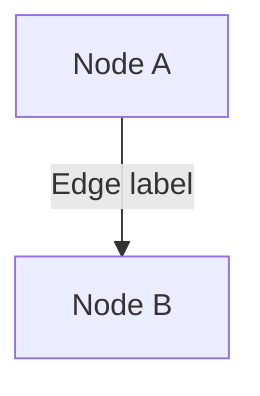
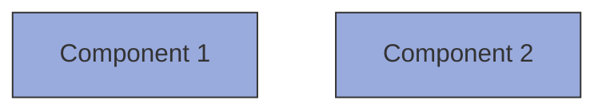
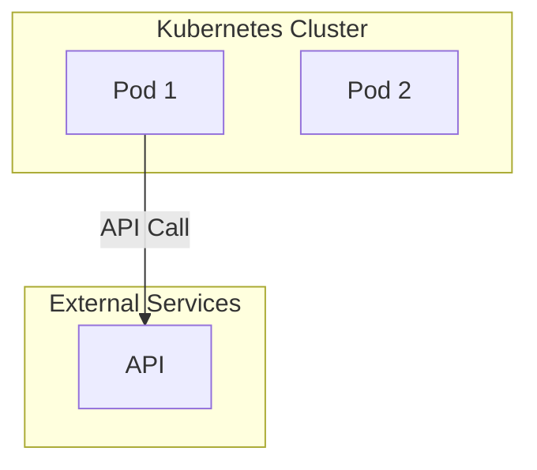
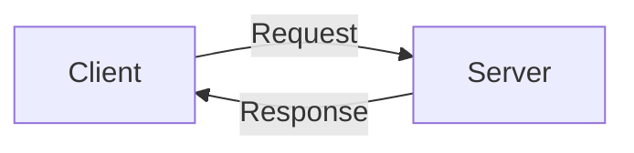
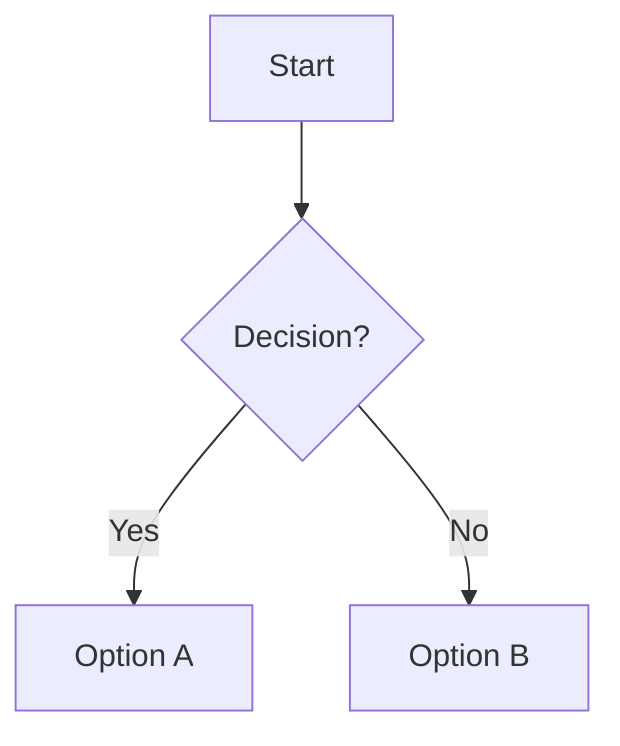

# Contributing to Mermaid Diagrams

Thank you for contributing to the architecture decision records! This guide will help you create and update Mermaid diagrams that render correctly on GitHub.

## Quick Start

1. **Create or edit a Mermaid diagram** in `mermaid-diagrams/`
2. **Test locally** using the validation script
3. **Submit a pull request** - automated validation will run
4. **Fix any errors** reported by the validation workflow

## Creating New Diagrams

### 1. Use the Mermaid Live Editor

Start by creating your diagram in the [Mermaid Live Editor](https://mermaid.live/):

1. Visit https://mermaid.live/
2. Design your diagram interactively
3. Test different syntax variations
4. Copy the validated code

### 2. Follow GitHub Constraints

GitHub's Mermaid renderer has specific constraints:

#### ✅ Allowed Syntax

**Node Labels** (can use `<br/>` for line breaks):
```mermaid
Node1["Multi-line<br/>label"]
Node2["Label with (parentheses)"]
Node3["Label with: colons"]
```

**Edge Labels** (must quote special characters):
```mermaid
A -->|"text with (parens)"| B
C -->|"path/to/resource"| D
E -->|"key: value"| F
```

#### ❌ Forbidden Syntax

**Edge Labels with `<br/>` tags**:
```mermaid
❌ A -->|line1<br/>line2| B
✅ A -->|"line1 line2"| B
```

**Unquoted special characters in edge labels**:
```mermaid
❌ A -->|text (B)| C
✅ A -->|"text (B)"| C

❌ A -->|path/to/file| B
✅ A -->|"path/to/file"| B
```

### 3. File Naming Convention

Use descriptive kebab-case names:
- ✅ `kserve-network-architecture.md`
- ✅ `odh-operator-reconciler-flow.md`
- ❌ `diagram1.md`
- ❌ `My_Diagram.md`

### 4. File Structure

Each diagram file should include:

```markdown
# Diagram Title

## Brief Description



## Documentation Section

### Component 1
Description of component 1...

### Component 2
Description of component 2...

## Key Features

- Feature 1
- Feature 2

## Notes

Additional context...
```

## Testing Your Diagrams

### Local Validation

Before submitting a PR, validate locally:

```bash
# 1. Install dependencies (first time only)
cd .github
npm install
cd ..

# 2. Run validation script
./scripts/validate-mermaid.sh
```

### Expected Output

**Success**:
```
✅ All Mermaid diagrams validated successfully!
```

**Failure**:
```
❌ dashboard-architecture.md: FAILED (2 error(s))
  • Found unquoted parentheses in edge label
  • Found <br/> tag in edge label
```

### Fix Common Errors

The validation script will identify common issues:

1. **Unquoted parentheses**:
   ```diff
   - A -->|https (B)| C
   + A -->|"https (B)"| C
   ```

2. **`<br/>` in edge labels**:
   ```diff
   - A -->|Line 1<br/>Line 2| B
   + A -->|"Line 1 Line 2"| B
   ```

3. **Unquoted slashes/colons**:
   ```diff
   - A -->|Creates/Manages| B
   + A -->|"Creates/Manages"| B
   ```

## Pull Request Process

### 1. Create Your Branch

```bash
git checkout -b feature/my-diagram-name
```

### 2. Add Your Diagram

```bash
git add mermaid-diagrams/my-diagram.md
git commit -m "Add diagram for XYZ architecture"
```

### 3. Push and Create PR

```bash
git push origin feature/my-diagram-name
```

Then create a pull request on GitHub.

### 4. Automated Validation

The GitHub Actions workflow will automatically:

1. ✅ Validate Mermaid syntax
2. ✅ Check for common errors
3. ✅ Test rendering
4. 💬 Comment on PR with results

### 5. Review Results

If validation passes:
```
✅ All Mermaid diagrams validated successfully!
```

If validation fails, the bot will comment with details:
```
❌ Validation Failed

- ❌ my-diagram.md: FAILED (2 error(s))

Common Issues:
1. Unquoted parentheses in edge labels
2. <br/> tags in edge labels
```

### 6. Fix and Update

1. Fix the errors locally
2. Test with `./scripts/validate-mermaid.sh`
3. Commit and push changes
4. Validation runs automatically again

## Best Practices

### 1. Keep Diagrams Simple

- Focus on one concept per diagram
- Limit nodes to essential components
- Use subgraphs for logical grouping
- Avoid deeply nested structures

### 2. Use Consistent Styling

Apply consistent colors and styles:



### 3. Document Thoroughly

- Explain each component
- Describe data flows
- Note important relationships
- Provide context and rationale

### 4. Include Metadata

Add source attribution:

```markdown
## Source

- Original diagram: `path/to/original.png`
- ADR: `architecture-decision-records/component/ADR-001.md`
- Related docs: Links to relevant documentation
```

### 5. Test in Multiple Environments

Before finalizing:
- ✅ Test in Mermaid Live Editor
- ✅ Run local validation script
- ✅ Preview in GitHub after pushing
- ✅ Check on mobile view if applicable

## Updating Existing Diagrams

### 1. Always Read First

Before editing:
```bash
# View the existing diagram
cat mermaid-diagrams/existing-diagram.md
```

### 2. Preserve Context

Maintain existing:
- Documentation sections
- Source attributions
- Component descriptions
- Style conventions

### 3. Test Before Committing

```bash
# Validate your changes
./scripts/validate-mermaid.sh

# Check specific file
grep -A 50 '```mermaid' mermaid-diagrams/your-file.md
```

## Common Patterns

### Grouping with Subgraphs



### Bidirectional Flows



### Decision Trees



## Getting Help

### Validation Errors

If you're stuck on validation errors:

1. Check [VALIDATION.md](./VALIDATION.md) for common fixes
2. Review [GitHub's Mermaid documentation](https://github.blog/2022-02-14-include-diagrams-markdown-files-mermaid/)
3. Test in [Mermaid Live Editor](https://mermaid.live/)
4. Ask in PR comments or issue

### Syntax Questions

- [Mermaid Documentation](https://mermaid.js.org/)
- [Flowchart Syntax](https://mermaid.js.org/syntax/flowchart.html)
- [Styling Guide](https://mermaid.js.org/config/theming.html)

### Workflow Issues

If the GitHub Action fails unexpectedly:

1. Check workflow run logs
2. Download validation artifacts
3. Test locally with same Node version
4. Report issue with logs

## Resources

- [Mermaid Documentation](https://mermaid.js.org/)
- [Mermaid Live Editor](https://mermaid.live/)
- [GitHub Mermaid Support](https://github.blog/2022-02-14-include-diagrams-markdown-files-mermaid/)
- [Flowchart Syntax](https://mermaid.js.org/syntax/flowchart.html)
- [Validation Guide](./VALIDATION.md)

## Thank You!

Your contributions help make the architecture documentation clearer and more accessible. Thank you for taking the time to follow these guidelines! 🎉
