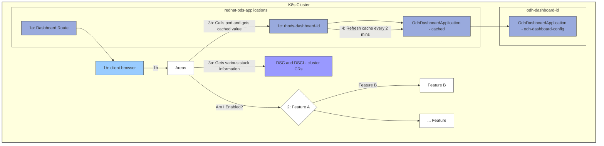

# Dashboard Feature Flags Architecture

## Feature Flag System Flow

## Component Flow Description

### 1. Initial Request Flow
- **1a**: Dashboard Route receives external requests
- **1b**: Client browser accesses the dashboard through the route
- **1c**: Request is forwarded to the rhods-dashboard pod

### 2. Feature Evaluation
- Client browser queries **"Areas"** component
- Areas component checks if features (A, B, etc.) are enabled
- Decision logic determines which features to activate

### 3. Information Gathering
- **3a**: Areas component retrieves stack information from DSC & DSCI (cluster CRs)
- **3b**: Areas calls the dashboard pod and retrieves cached configuration values

### 4. Cache Management
- Dashboard pod refreshes its cache **every 2 minutes**
- Cache pulls from OdhDashboardApplication (cached) resource
- Configuration sourced from odh-dashboard-config in the application namespace

## Key Components

### Namespaces
- **redhat-ods-applications**: Contains dashboard deployment and route
- **odh-dashboard-{id}**: Contains dashboard configuration

### Resources
- **DSC & DSCI**: Cluster-level custom resources defining platform state
- **OdhDashboardApplication**: Dashboard configuration resource (with caching)
- **Dashboard Route**: Entry point for browser-based access

### Caching Strategy
- 2-minute refresh interval for configuration cache
- Reduces load on Kubernetes API server
- Ensures relatively fresh configuration without constant API calls

## Feature Flag Decision Points
Features are evaluated based on:
1. Cluster-level configuration (DSC & DSCI)
2. Dashboard-specific configuration (OdhDashboardApplication)
3. Cached state from the dashboard pod
