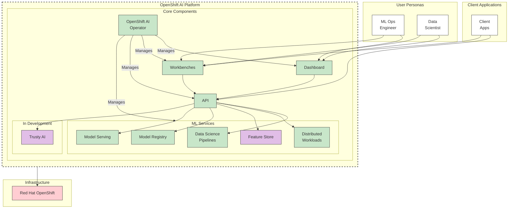

# RHOAI Architecture Overview (Mermaid Version)

> This document provides the same architectural information as [`documentation/arch-overview.md`](../../documentation/arch-overview.md) but uses interactive Mermaid diagrams instead of static images.

## Overview

Red Hat OpenShift AI (RHOAI) v2.13 enables Data Scientists and ML Engineers to execute end-to-end ML workflows through the integration of Red Hat components, Open Source software, and ISV offerings.

RHOAI is based on [Open Data Hub](http://opendatahub.io/) and includes Kubeflow, Jupyter Notebooks, Model Serving, Pipelines, Monitoring, and additional features.

## Architecture Overview

The complete RHOAI component architecture showing user personas, core components, and infrastructure:

[View Diagram: RHOAI Components Overview](../rhoai-components-overview.md)

## Components and Services

### RHOAI Dashboard

Customer-facing dashboard presenting components as a unified experience.

[View Diagram: Dashboard Feature Flags](../dashboard-feature-flags.md)

**Features**:
- Core components included as supported functionality
- Integrated Red Hat applications (API Management)
- Integrated ISV applications (Starburst, Anaconda, Intel OpenVino, NVIDIA GPU Operator)
- Tutorials, documentation, quick starts

### Workbenches / Notebook Servers

Data Science focused IDEs for model development.

**Components**:
- Kubeflow Notebook Controller - creation and management
- ODH Notebook Controller - routing and security
- JupyterLab - primary notebook interface

### Model Serving

[View Diagram: KServe Network Architecture](../kserve-private-network-in-cluster.md)

**Components**:
- **KServe ModelMesh Controller**: Multi-model deployment management
  - Includes etcd for mesh metadata persistence
- **ODH Model Mesh Controller**: Routing and security
- **KServe Controller**: Single model deployment management
  - Dependencies: OpenShift Serverless, Service Mesh

### TrustyAI Service

Model inference data storage and fairness metrics.

[View Diagram: TrustyAI Architecture](../trustyai-explainability-architecture.md)

### Data Science Pipelines

[View Diagram: DSP v2 Architecture](../dsp-v2-architecture.md)

Kubeflow Pipelines v2 implementation for ML workflow orchestration.

For detailed architecture, see the [Data Science Pipelines Architecture](https://docs.google.com/document/d/1OA9PZpJ8pYxflCFbzLOuVZ3UQyvyGupIcsv6ci2SC5Y/edit?usp=sharing) document.

### Distributed Workload

**Components**:
- **Ray**: Distributed computing for scaling ML workloads
- **CodeFlare**: ML pipeline orchestration
- **Kueue**: Job queuing and prioritization

### Model Registry

[View Diagram: Model Registry Overview](../model-registry-overview.md)

Model metadata management and version control across the ML lifecycle.

### Feature Store

Feature engineering and management with Feast.

**Components**:
- Feature Store Controller - manages Feast Feature Servers
- Online store, offline store, and registry

## Management

### RHOAI Operator

[View Diagram: Platform Architecture](../platform-architecture-overview.md)

Meta-operator responsible for deploying and maintaining all RHOAI components.

**Current Architecture**: [ODH Operator Current](../odh-operator-current-architecture.md)
**Proposed Architecture**: [ODH Operator Next](../odh-operator-next-architecture.md)

### Monitoring

Prometheus gathers metrics from deployed components for monitoring and billing.

## API

Most APIs are saved as Kubernetes custom resources.

**Key CRDs**:
- Dashboard: `odhdashboardconfigs.opendatahub.io`, `odhapplications.dashboard.opendatahub.io`
- Notebooks: `notebooks.kubeflow.org`
- Model Serving: `servingruntimes.serving.kserve.io`, `inferenceservices.serving.kserve.io`
- Pipelines: `datasciencepipelinesapplications.datasciencepipelinesapplications.opendatahub.io`
- Feature Store: `featurestores.feast.dev`

## Deployment

RHOAI is deployed as an operator via:
- **Self-managed**: OpenShift Console → Operators → OperatorHub
- **Managed**: Red Hat Cluster Manager as addon for OSD/ROSA

**Namespaces Created**:
1. `redhat-ods-operator`: Management and operator artifacts
2. `redhat-ods-applications`: Component deployments
3. `rhods-notebooks`: Shared notebook namespace
4. `redhat-ods-monitoring`: Monitoring stack

## Network Architecture

See individual component network diagrams:
- [Dashboard Network](../../documentation/images/network/Dashboard.png)
- [Workbenches Network](../../documentation/images/network/Workbenches.png)
- [Data Science Pipelines Network](../../documentation/images/network/DataScienePipelines.png)
- [Model Serving Network](../../documentation/images/network/ModelServing.png)
- [TrustyAI Network](../../documentation/images/network/TrustyAI.png)
- [Model Registry Network](../../documentation/images/network/ModelRegistry.png)

## Storage and Data

**User Data**:
- Jupyter notebook PVCs for user files and datasets
- Connection to arbitrary storage providers (S3, etc.)

**System Data**:
- Model mesh etcd for metadata
- Custom resources in cluster etcd

## Resource Requirements

| Component | Pods | vCPU Req/Limit | Memory Req/Limit |
|-----------|------|----------------|------------------|
| RHOAI Operator | 1 | 50m / 100m | 500Mi / 6Gi |
| Dashboard | 5 | 500m+100m / 1000m+100m | 1Gi+256Mi / 2Gi+256Mi |
| Notebooks | 2 | 500m / 500m (each) | 256Mi / 4Gi (each) |
| Model Serving | 3+3+1 | varies | varies |
| Monitoring | 2 | 200m+100m / 400m+100m | 2Gi+256Mi / 4Gi+256Mi |
| DSP | 1 | 10m / 1000m | 64Mi / 4Gi |
| Feature Store | 1 | 5m / 5000m | 64Mi / 128Mi |

**Total Infrastructure**: ~5 vCPUs and ~11GB memory

## References

- **Full Documentation**: [documentation/arch-overview.md](../../documentation/arch-overview.md)
- **Component Details**: [documentation/components/](../../documentation/components/)
- **Mermaid Diagrams**: [../README.md](../README.md)

## See Also

- [Component-Specific Documentation](./components/)
- [Platform Architecture Details](./PLATFORM-ARCHITECTURE.md)
- [Dashboard Architecture](./components/DASHBOARD.md)
- [Model Serving Architecture](./components/MODEL-SERVING.md)
- [Data Science Pipelines Architecture](./components/PIPELINES.md)
