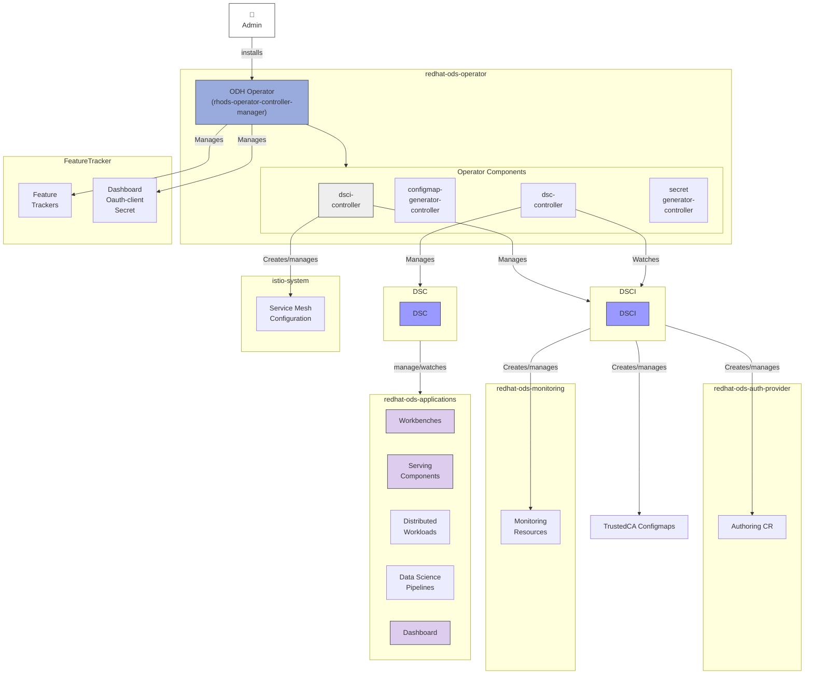

# Platform Architecture (Mermaid Version)

> This document provides the same information as [`documentation/components/platform/README.md`](../../documentation/components/platform/README.md) but uses interactive Mermaid diagrams.

## Overview

The Platform component is responsible for maintaining the core ODH Operator and establishing standards for component deployments, monitoring, security, and ecosystem integration.

## ODH Operator APIs

### DSCInitialization API

**Purpose**: Defines configuration required by the ODH platform before applications are deployed.

**Responsibilities**:
- Creation of applications and monitoring namespaces
- Component-wide configurations (Authorization, monitoring, etc.)

**Reference**: [API Documentation](https://github.com/opendatahub-io/opendatahub-operator/blob/incubation/docs/api-overview.md#dscinitializationopendatahubiov1)

### DataScienceCluster API

**Purpose**: End user interface to enable various data science components.

**Responsibilities**:
- Enable support for Notebooks, DataSciencePipelinesApplication, InferenceService
- Component configuration management

**Reference**: [API Documentation](https://github.com/opendatahub-io/opendatahub-operator/blob/incubation/docs/api-overview.md#datascienceclusteropendatahubiov1)

## Platform Architecture Overview

[View Full Diagram](../platform-architecture-overview.md)



## Architecture Components

### Admin Installation Flow

1. Administrator installs ODH Operator
2. Operator deployed in `redhat-ods-operator` namespace
3. Operator controllers initialize

### ODH Operator Controllers

#### DSCI Controller
**Manages**: DSCInitialization (DSCI) resources

**Creates and manages**:
- Service Mesh Configuration (`istio-system`)
- Authoring CR (`redhat-ods-auth-provider`)
- Monitoring Resources (`redhat-ods-monitoring`)
- TrustedCA Configmaps

#### DSC Controller
**Manages**: DataScienceCluster (DSC) resources

**Responsibilities**:
- Watches DSCI for platform readiness
- Manages application components in `redhat-ods-applications`

#### ConfigMap Generator Controller
Generates configuration for components.

#### Secret Generator Controller
Manages secrets including Dashboard OAuth client secret.

### Platform Resources

#### Feature Tracker
- Cluster-wide resource tracking
- Owner reference management
- Enables precise resource cleanup

#### Dashboard OAuth Secret
- Managed by operator
- Provides OAuth authentication for Dashboard

### Platform Infrastructure Namespaces

| Namespace | Purpose | Managed By |
|-----------|---------|------------|
| `istio-system` | Service Mesh Configuration, Network/Security policies | DSCI controller |
| `redhat-ods-auth-provider` | Authentication, OAuth, Identity management | DSCI |
| `redhat-ods-monitoring` | Metrics collection and alerting | DSCI |

### Application Components (`redhat-ods-applications`)

All components managed by DSC controller:

- **Workbenches**: Jupyter notebooks and development environments
- **Serving Components**: KServe, ModelMesh deployments
- **Distributed Workloads**: Ray, Kubeflow Training Operator
- **Data Science Pipelines**: Kubeflow Pipelines v2
- **Dashboard**: Web UI for platform management
- **Additional Components**: Feature Store, Model Registry, TrustyAI

## Control Flow

### Installation Flow
```
1. Admin installs ODH Operator
   ↓
2. Operator controllers start in redhat-ods-operator namespace
```

### Platform Initialization Flow
```
1. DSCI controller watches for DSCInitialization CR
   ↓
2. Creates platform infrastructure:
   - Service Mesh in istio-system
   - Auth provider in redhat-ods-auth-provider
   - Monitoring in redhat-ods-monitoring
   - TrustedCA Configmaps
```

### Application Deployment Flow
```
1. DSC controller watches for DataScienceCluster CR
   ↓
2. DSC controller watches DSCI for readiness
   ↓
3. Deploys and manages application components
   ↓
4. Each component creates Kubernetes resources
```

## Operator Evolution

### Current Architecture

[View Detailed Diagram](../odh-operator-current-architecture.md)

**Key characteristics**:
- DSCI Reconciler handles platform API
- DSC Reconciler handles components
- Resources create and manage reconcilers

### Proposed Architecture

[View Detailed Diagram](../odh-operator-next-architecture.md)

**Improvements**:
- Component-specific reconcilers
- New Components API layer
- Better separation of concerns
- Consistent reconciliation pattern

## Authorization in Service Mesh

For Service Mesh authorization details, see:
- Original documentation: [Authorization in Service Mesh](../../documentation/components/platform/Authorization%20in%20Service%20Mesh.png)

## Key Design Principles

- **Namespace Isolation**: Separate namespaces for operator, platform, and applications
- **Declarative Management**: CR-driven configuration (DSCI, DSC)
- **Resource Tracking**: FeatureTracker for precise lifecycle management
- **Layered Architecture**: Platform layer (DSCI) → Application layer (DSC)

## References

- **Full Documentation**: [documentation/components/platform/README.md](../../documentation/components/platform/README.md)
- **API References**: [ODH Operator API Docs](https://github.com/opendatahub-io/opendatahub-operator/blob/incubation/docs/api-overview.md)
- **Mermaid Diagrams**: [../README.md](../README.md)
