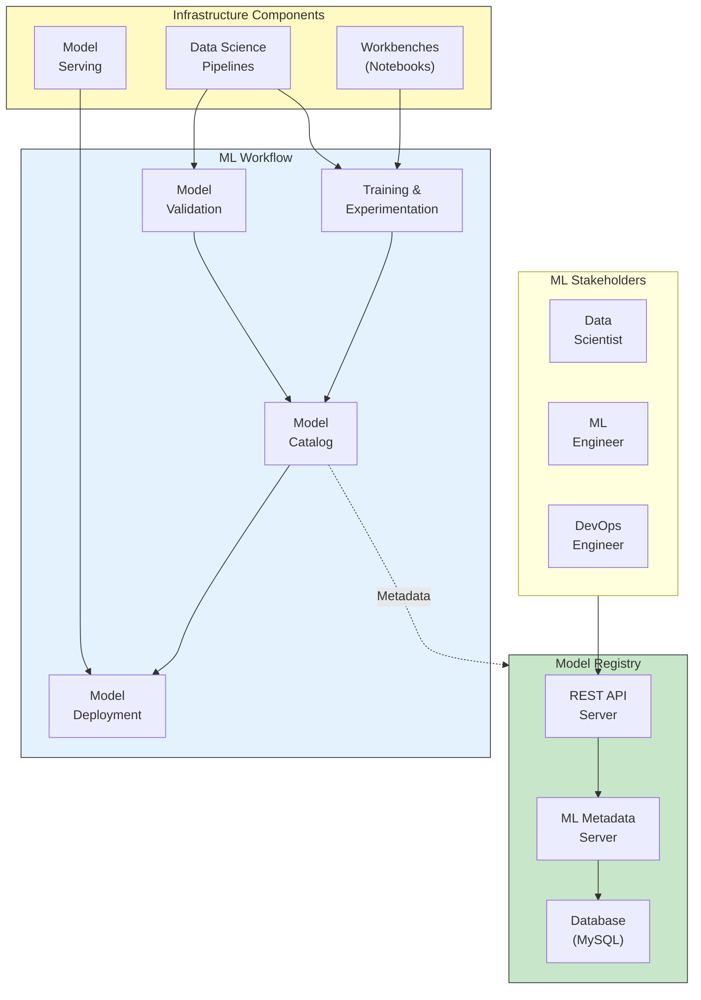
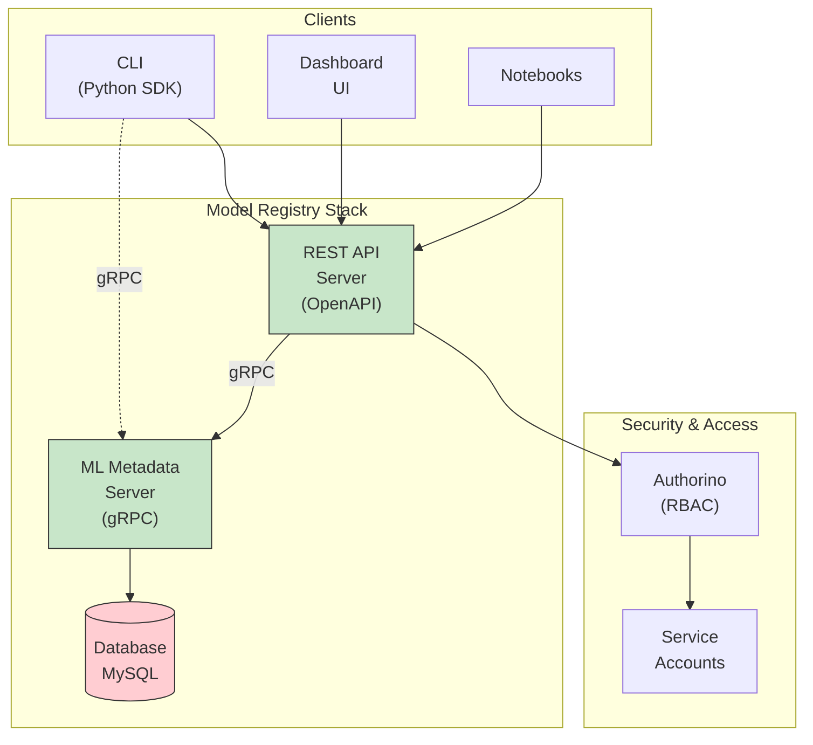
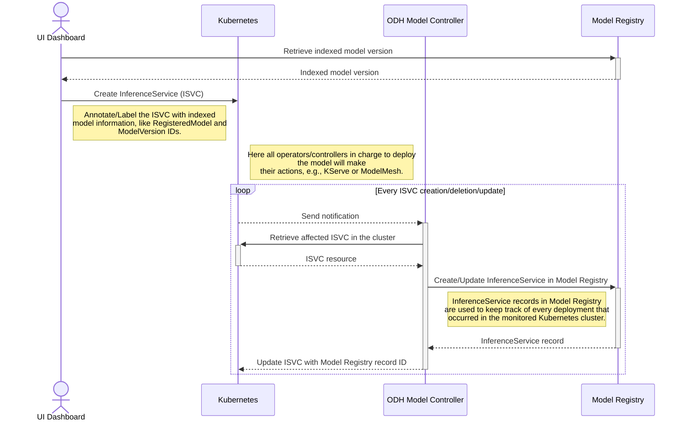

# Model Registry Architecture (Mermaid Version)

> This document provides the same information as [`documentation/components/model-registry/README.md`](../../../documentation/components/model-registry/README.md) but uses interactive Mermaid diagrams.

## Introduction

A model registry plays a pivotal role in the lifecycle of AI/ML models, serving as the central repository holding metadata pertaining to machine learning models from inception to deployment. This encompasses both high-level details like deployment environment and project origins, as well as intricate information like training hyperparameters, performance metrics, and deployment events. Acting as a bridge between model experimentation and serving, it offers a secure, collaborative interface of a metadata store for stakeholders involved in the ML lifecycle.

## Model Registry Overview

[View Full Diagram](../../model-registry-overview.md)

The Model Registry provides a centralized metadata repository for the complete ML lifecycle:

> **Note**: The Model Registry is a passive repository for metadata and is not meant to be a Control Plane. It does not perform any orchestration or expose APIs to perform actions on underlying OpenShift AI components.

The model registry is a backing store for various stages of MLOps that can log user flow of a model development and deployment. The model registry meets a data scientist's need to be able to visualize a model's lineage and trace back the training executions, parameters, metrics, etc. It also helps deployment engineers visualize model pipeline events, actions, progress through deployment stages, etc.

## Goals

- Associate metadata from training, experimentation, studies and their metrics, with a model
- Build a catalog of models and manage model versions for deployment
- Management of model for multiple deployment environments
- Build a Kube Native solution

## Architecture

Google community project [ML-Metadata](https://github.com/google/ml-metadata) is used as the core component to build the Model Registry. ML-Metadata provides a very extensible schema that is generic, similar to a key-value store, but also allows for the creation of logical schemas that can be queried as if they were physical schemas. Those can be manipulated using their bindings in the Python library. We use this model to extend and provide metadata storage services for model serving, also known as Model Registry.

The model registry uses the ml-metadata project's C++ server as-is to handle the storing of the metadata, while domain-specific Model Registry features are added as extensions (aka microservices). As part of these extensions, Model Registry provides:

- Python/Go extensions to support the Model Registry interaction
- An OpenAPI interface to expose the Model Registry API to the clients

### Architecture Components

Enforcing of RBAC policies can be handled at the REST API layer using service accounts with Authorino. Details about [RBAC and Tenancy](../../../documentation/components/model-registry/model-registry-tenancy.md) are described in the linked documentation.

## Components

### MLMD C++ Server
**Repository**: [github.com/google/ml-metadata](https://github.com/google/ml-metadata)

This is the metadata server from Google's ml-metadata project. This component is hosted to communicate with a backend relational database that stores the actual metadata about the models. This server exposes a "gRPC" interface for its clients to communicate with. This server provides a very flexible schema model, where using this model one can define logical data models to fit the needs of different MLOps operations, for example, metadata during the training and experimentation, metadata about metrics or model versioning, etc.

### OpenAPI/REST Server
**Repository**: [github.com/kubeflow/model-registry](https://github.com/kubeflow/model-registry)

This component exposes a higher-level REST API of the Model Registry. In contrast, the MLMD server exposes a lower level generic API over gRPC, whereas this REST server exposes a higher level API that is much closer to the domain model of Model Registry, like:

- Register a Model
- Version a Model
- Get a catalog of models
- Manage the deployment statuses of a model

The REST API server converts its requests into one or more underlying gRPC requests on the MLMD Server. This layer is mainly designed to be used with UI.

### Model Registry Controller
**Repository**: [github.com/opendatahub-io/model-registry-operator](https://github.com/opendatahub-io/model-registry-operator)

Model Registry controller is also called Model Registry Operator. The main purpose of this component is to install/deploy components of the Model Registry stack on OpenShift. Once the components are installed, the reconciler in the controller will continuously run and monitor these components to keep them healthy and alive.

### CLI (Python Client, SDK)
**Repository**: [github.com/kubeflow/model-registry/tree/main/clients/python](https://github.com/kubeflow/model-registry/tree/main/clients/python)

CLI is also called MR Python client/SDK, a command line tool for interacting with Model Registry. This tool can be used by a user to execute operations such as retrieving the registered models, get model's deployment status, model's version etc.

The model registry provides logical mappings from the high level [logical model](https://github.com/kubeflow/model-registry/blob/main/docs/logical_model.md) available through the OpenAPI/REST Server, to the underlying ml-metadata entities.

## Integration with Model Serving Components

In a typical ML workflow, a ML model is registered on the Model Registry as a `RegisteredModel` logical entity, along with its versions and its associated `ModelArtifacts` resources.

Then, Model serving controller advertises itself to the Model Registry, by creating a `ServingEnvironment` entity.

Then, the Model Controller reconciler monitors `InferenceService` CRs having pre-defined `labels`, and based on those `labels` it syncs the model registry by keeping track of every deployment that occurred in the cluster.

Finally, the Model Controller reconciler updates the `InferenceService` CR by linking it to the Model Registry logical entity using a specific `label`.

### Integration Workflow

In this way, the Model Controller reconciler syncs those occurrences into the Model Registry to keep track of every deployment that occurred in the cluster for indexed models.

## ML Lifecycle Integration

### Model Development Phase
**Components**: Workbenches, Data Science Pipelines

**Activities**:
- Experiment tracking
- Hyperparameter tuning
- Training runs
- Metrics collection

**Model Registry Usage**:
- Register experiments
- Log parameters and metrics
- Associate artifacts with runs
- Version model iterations

### Model Validation Phase
**Components**: Data Science Pipelines, Testing Frameworks

**Activities**:
- Model evaluation
- Performance benchmarking
- Validation against test datasets
- Quality assurance

**Model Registry Usage**:
- Record validation metrics
- Store evaluation results
- Link validation runs to models
- Track approval status

### Model Deployment Phase
**Components**: Model Serving (KServe, ModelMesh)

**Activities**:
- Model deployment
- Serving infrastructure setup
- Environment configuration
- Monitoring setup

**Model Registry Usage**:
- Create deployment records
- Link to serving environments
- Track deployment status
- Record deployment metadata

### Model Monitoring Phase
**Components**: TrustyAI, Monitoring Stack

**Activities**:
- Performance monitoring
- Drift detection
- Fairness metrics
- Explainability analysis

**Model Registry Usage**:
- Store monitoring metrics
- Track model performance
- Record drift events
- Link to explainability reports

## Metadata and Control APIs

The Model Registry provides two types of APIs:

### Metadata APIs
**Purpose**: Store and retrieve model metadata

**Capabilities**:
- Model registration
- Version management
- Artifact tracking
- Lineage tracking
- Metrics storage

**Access**: REST API, Python SDK, gRPC

### Control APIs
**Purpose**: Manage model lifecycle

**Capabilities**:
- Deployment status updates
- Environment management
- Approval workflows
- Stage transitions

**Access**: REST API, Python SDK

> **Important**: Model Registry does NOT provide control plane capabilities for infrastructure components. It does not orchestrate deployments or manage serving infrastructure.

## Data Model

### Core Entities

**RegisteredModel**:
- Model name and description
- Owner and creation metadata
- Associated versions

**ModelVersion**:
- Version identifier
- Associated artifacts
- Metadata and tags
- Parent model reference

**ModelArtifact**:
- Artifact URI
- Format and type
- Storage location
- Associated version

**ServingEnvironment**:
- Environment identifier
- Infrastructure details
- Deployment platform

**InferenceService**:
- Deployment instance
- Serving environment link
- Model version reference
- Deployment metadata

## Security and Access Control

### RBAC Implementation
- Role-based access control at REST API layer
- Service account authentication
- Namespace-level isolation
- Fine-grained permissions

### Authorino Integration
- Policy enforcement
- Identity verification
- Access control decisions
- Audit logging

## Storage and Persistence

### Database Backend
**Supported**: MySQL/MariaDB

**Stored Data**:
- Model metadata
- Version information
- Artifact references
- Deployment records
- Metrics and parameters

### Artifact Storage
**External Storage**: Model artifacts stored in S3-compatible object storage

**References**: Model Registry stores URI references, not actual artifacts

## References

- **Full Documentation**: [documentation/components/model-registry/README.md](../../../documentation/components/model-registry/README.md)
- **Model Registry Overview Diagram**: [model-registry-overview.md](../../model-registry-overview.md)
- **RBAC and Tenancy**: [model-registry-tenancy.md](../../../documentation/components/model-registry/model-registry-tenancy.md)
- **Logical Model**: [Model Registry Logical Model](https://github.com/kubeflow/model-registry/blob/main/docs/logical_model.md)
- **Mermaid Diagrams**: [../README.md](../../README.md)
