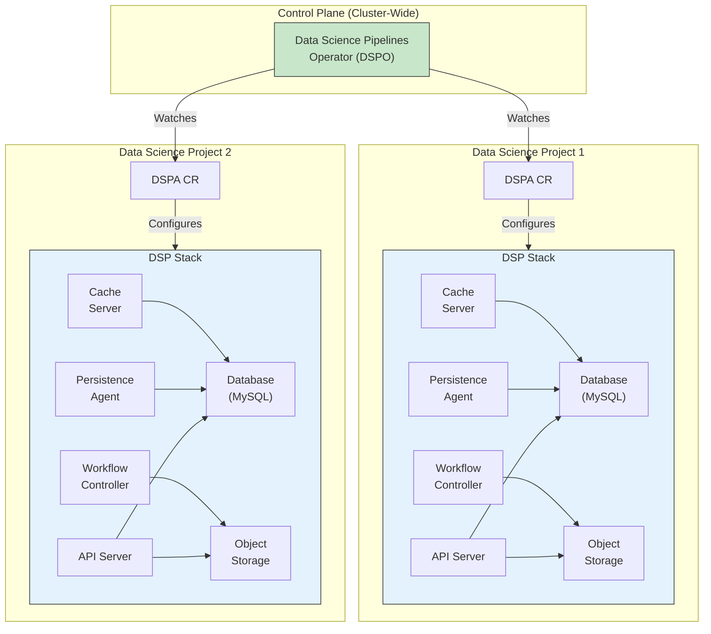

# Data Science Pipelines (Mermaid Version)

> This document provides the same information as [`documentation/components/pipelines/README.md`](../../../documentation/components/pipelines/README.md) but uses interactive Mermaid diagrams.

## Overview

Data Science Pipelines is a platform for building and deploying portable, scalable machine learning (ML) workflows based on containers. It is based on Kubeflow Pipelines and relies on Argo Workflows to run the pipelines. Additionally, Data Science Pipelines includes a custom "control plane" on top of Kubeflow Pipelines -- an operator we refer to as Data Science Pipelines Operator (DSPO). DSPO manages the "data planes", the individual "Data Science Pipelines Applications" (aka "stacks") that are deployed in each Data Science Project (kubernetes namespace).

## Data Science Pipelines Operator APIs

### DataSciencePipelinesApplication (DSPA)

- **API Reference**: [dspipeline_types.go](https://github.com/opendatahub-io/data-science-pipelines-operator/blob/main/api/v1alpha1/dspipeline_types.go)
- This CRD is responsible for defining the configuration of the Data Science Pipelines stack.

## Architecture

### DSP v2 Architecture Overview

[View Full Diagram](../../dsp-v2-architecture.md)

The Data Science Pipelines v2 architecture consists of two main layers:

#### Control Plane (DSPO)
The Data Science Pipelines Operator manages the lifecycle of DSP instances:

**Components**:
- **DSPO Controller**: Watches DSPA custom resources
- **Resource Manager**: Creates and configures pipeline infrastructure
- **Configuration Manager**: Handles storage, database, and service configurations

**Responsibilities**:
- Deploy DSP stacks per namespace
- Manage infrastructure resources
- Configure persistence and storage
- Lifecycle management of pipeline components

#### Data Plane (DSP Stack)

Each Data Science Project gets its own DSP stack with the following components:

**API Layer**:
- **DSP API Server**: REST API for pipeline operations
- **Metadata API**: Model and artifact metadata management

**Execution Layer**:
- **Workflow Controller**: Argo Workflows for pipeline execution
- **Persistence Agent**: Saves pipeline run metadata
- **Cache Server**: Caching for pipeline steps

**Storage Layer**:
- **Object Storage**: Artifact and model storage (S3-compatible)
- **Database**: MySQL/MariaDB for metadata persistence

### Architecture Diagram



## Kubeflow Pipelines v2

Data Science Pipelines is based on Kubeflow Pipelines v2, which provides:

### Key Features

- **Component-Based**: Pipelines built from reusable components
- **Container-Native**: Each step runs in its own container
- **Portable**: Run pipelines across different environments
- **Scalable**: Leverage Kubernetes for scaling
- **Versioned**: Track pipeline and component versions

### Pipeline Execution Flow

```
1. User submits pipeline via SDK or UI
   ↓
2. API Server validates and stores pipeline definition
   ↓
3. Workflow Controller creates Argo Workflow
   ↓
4. Argo executes pipeline steps as pods
   ↓
5. Persistence Agent saves metadata and artifacts
   ↓
6. Cache Server stores results for reuse
   ↓
7. Pipeline completion and artifact storage
```

## Integration with Argo Workflows

DSP uses Argo Workflows as the execution engine:

**Benefits**:
- Mature workflow orchestration
- DAG (Directed Acyclic Graph) execution
- Retry and error handling
- Resource management
- Parallel execution support

**Integration Points**:
- Workflow Controller manages pod lifecycle
- Custom resource definitions for workflows
- Event-driven execution
- Artifact passing between steps

## Storage and Persistence

### Object Storage (S3-Compatible)

**Purpose**: Store pipeline artifacts, models, and intermediate data

**Configuration Options**:
- AWS S3
- MinIO
- Red Hat OpenShift Data Foundation
- Other S3-compatible storage

**Usage**:
- Input/output artifacts
- Model files
- Logs and metrics
- Cached results

### Database (MySQL/MariaDB)

**Purpose**: Store pipeline metadata and execution history

**Stored Information**:
- Pipeline definitions
- Run metadata
- Execution status
- Metrics and parameters
- Component relationships

## API Access Patterns

### DSP API Server

**Endpoints**:
- Pipeline CRUD operations
- Run management
- Experiment organization
- Artifact management

**Authentication**:
- Bearer token authentication
- OAuth proxy integration
- K8s RBAC enforcement

### Dashboard Integration

The OpenShift AI Dashboard provides:
- Visual pipeline editor
- Run monitoring
- Artifact visualization
- Execution history
- Metrics and logs

## DSPA Custom Resource

### Basic Configuration

```yaml
apiVersion: datasciencepipelinesapplications.opendatahub.io/v1alpha1
kind: DataSciencePipelinesApplication
metadata:
  name: pipelines-definition
  namespace: my-project
spec:
  apiServer:
    deploy: true
  database:
    mariaDB:
      deploy: true
      pipelineDBName: mlpipeline
  objectStorage:
    minio:
      deploy: true
      bucket: mlpipeline
  persistenceAgent:
    deploy: true
```

### Advanced Configuration Options

- **External Database**: Use existing MySQL/MariaDB instance
- **External Object Storage**: Connect to existing S3 bucket
- **Resource Limits**: Configure CPU and memory for components
- **Custom Images**: Use specific component versions
- **TLS Configuration**: Enable encrypted connections

## Pipeline Development Workflow

### 1. Component Development
- Define component interface
- Implement component logic
- Containerize component
- Test component independently

### 2. Pipeline Composition
- Import components
- Define pipeline DAG
- Configure parameters
- Set dependencies

### 3. Pipeline Deployment
- Compile pipeline to YAML
- Upload to DSP
- Create experiment
- Submit run

### 4. Execution Monitoring
- Track run progress
- View logs and metrics
- Inspect artifacts
- Debug failures

## Caching and Optimization

### Step Caching

**Benefits**:
- Faster iteration during development
- Reduced compute costs
- Reproducible results

**Cache Invalidation**:
- Input parameter changes
- Component code modifications
- Explicit cache clearing

### Parallel Execution

**Capabilities**:
- Independent steps run concurrently
- Resource-efficient scheduling
- Reduced total pipeline time

## Error Handling and Retry

### Automatic Retry
- Configurable retry policies
- Exponential backoff
- Step-level configuration

### Failure Modes
- Step failure handling
- Pipeline-level error handling
- Notifications and alerts

## Monitoring and Observability

### Metrics Collection
- Pipeline execution time
- Step duration
- Resource utilization
- Success/failure rates

### Logging
- Step-level logs
- System logs
- Audit trails

### Integration with Monitoring Stack
- Prometheus metrics
- Dashboard visualization
- Alert configuration

## References

- **Full Documentation**: [documentation/components/pipelines/README.md](../../../documentation/components/pipelines/README.md)
- **DSP v2 Architecture Diagram**: [dsp-v2-architecture.md](../../dsp-v2-architecture.md)
- **Kubeflow Pipelines v2 Design**: [System Design Document](https://docs.google.com/document/d/1fHU29oScMEKPttDA1Th1ibImAKsFVVt2Ynr4ZME05i0/edit) (requires kubeflow-discuss group membership)
- **KFP v2 Control Flow**: [Control Flow Document](https://docs.google.com/document/d/1TZeZtxwPzAImIu8Jk_e-4otSx467Ckf0smNe7JbPReE/edit) (requires kubeflow-discuss group membership)
- **Mermaid Diagrams**: [../README.md](../../README.md)
