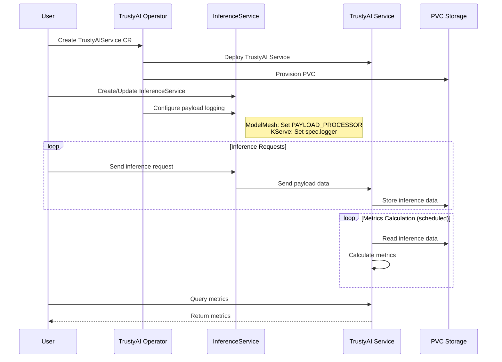
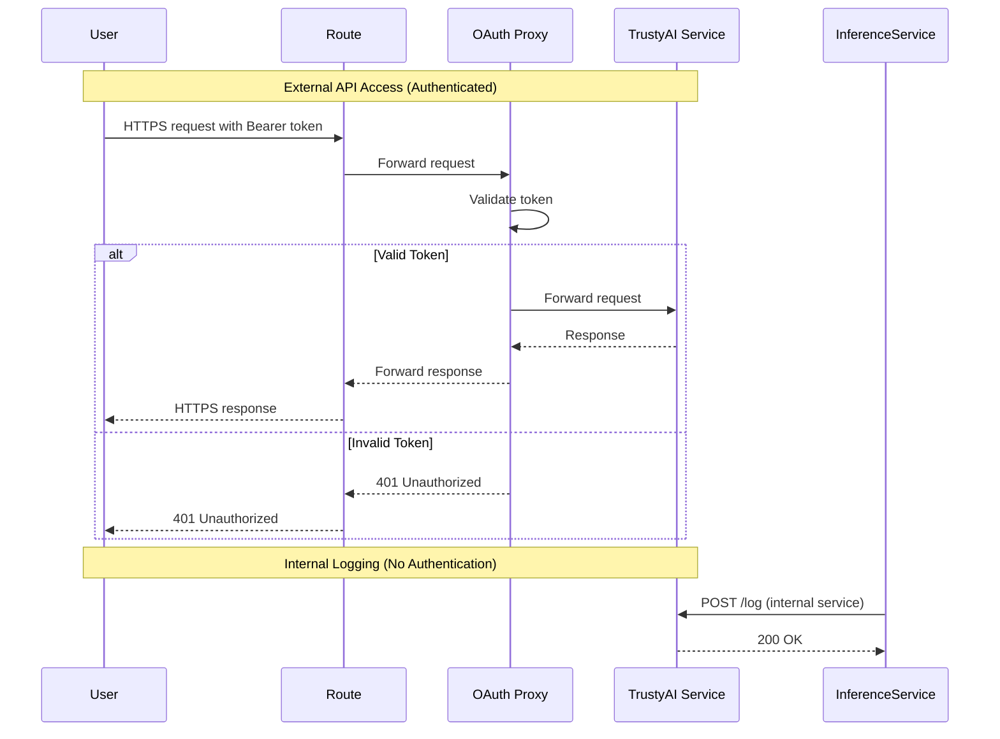

# TrustyAI / Model Explainability Architecture (Mermaid Version)

> This document provides the same information as [`documentation/components/explainability/README.md`](../../../documentation/components/explainability/README.md) but uses interactive Mermaid diagrams.

## Overview

[View Full Diagram](../../trustyai-explainability-architecture.md)

The TrustyAI operator is responsible for managing the lifecycle of `TrustyAIService` (TAS) Custom Resources (CR). TrustyAI provides model explainability, fairness metrics, and bias detection capabilities for deployed models in OpenShift AI.

## TrustyAIService

TrustyAI is designed to support a single `TrustyAIService` per namespace/project. Although multiple TASs can be created in the same namespace, and indeed work, due to the architecture this will not bring any additional benefit, and will only duplicate the computations performed by a single TAS.

In the following sections, we will always assume a single TAS per namespace.

### Custom Resource Syntax

The general syntax of the `TrustyAIService` CR is as follows:

```yaml
apiVersion: trustyai.opendatahub.io/v1alpha1
kind: TrustyAIService
metadata:
  name: trustyai-service
spec:
  storage:
    format: "PVC"
    folder: "/inputs"
    size: "1Gi"
  data:
    filename: "data.csv"
    format: "CSV"
  metrics:
    schedule: "5s"
```

**Configuration Parameters**:

- `metadata.name`: Specifies the name of the `TrustyAIService`
- `spec.storage.format`: Storage format (currently only `PVC` is supported)
- `spec.storage.folder`: Folder where the input data is stored
- `spec.storage.size`: Size of the PVC to be used for storage
- `spec.data.filename`: Suffix of the storage file
- `spec.data.format`: Format of the data file (only `CSV` supported at the moment)
- `metrics.schedule`: Interval at which metrics are calculated when a calculation request is registered with the service

### Provisioned Resources

The default behaviour when installing a CR in a namespace is for the operator to provision the following resources:

| Type | Name | Description |
|------|------|-------------|
| Deployment | `$(metadata.name)` | Deploys a pod with two containers (service and OAuth) |
| PersistentVolumeClaim | `$(metadata.name)-pvc` | Claims a volume for the storage of the inference data |
| Service | `$(metadata.name)-service` | Internal service to the TrustyAI REST server |
| Service | `$(metadata.name)-tls` | Service to expose the TrustyAI OAuth server |
| Route | `$(metadata.name)` | Route exposing the `$(metadata.name)-tls` |

## Architecture Components

### TrustyAI Service Operator

**Repository**: [github.com/trustyai-explainability/trustyai-service-operator](https://github.com/trustyai-explainability/trustyai-service-operator)

**Responsibilities**:
- Lifecycle management of TrustyAIService CRs
- Automatic integration with InferenceServices
- Payload logging configuration
- Resource provisioning and management

### TrustyAI Service Pod

**Containers**:
1. **TrustyAI Service Container**: Core explainability and metrics service
2. **OAuth Proxy Container**: Authentication and authorization

**Capabilities**:
- Inference data collection
- Fairness metrics calculation
- Bias detection
- Explainability analysis
- REST API for metrics retrieval

### Data Storage

**PersistentVolumeClaim**:
- Stores inference request/response data
- CSV format for structured storage
- Configurable size
- Mounted to TrustyAI service pod

## Payload Consumption and Integration

When an `InferenceService` (IS), either ModelMesh or KServe, is detected by the operator in the same namespace as a `TrustyAIService`, the operator will automatically configure the `InferenceService` to send the inference data to the `TrustyAIService` for processing.

### ModelMesh Integration

When a ModelMesh InferenceService is detected:

**Configuration**:
- Operator sets the `PAYLOAD_PROCESSOR` environment variable to the internal `$(metadata.name)-service`
- `PAYLOAD_PROCESSOR` is interpreted by ModelMesh as a space-delimited list of endpoints
- If additional endpoints are present, the operator appends the `$(metadata.name)-service` to the list
- If the processor is already present, the operator will not modify the list

**Data Flow**:
```
ModelMesh IS → PAYLOAD_PROCESSOR → TrustyAI Service → PVC Storage
```

### KServe Integration

In the case of KServe, the operator will either add (if not present) or replace the `spec.logger` field with the internal `$(metadata.name)-service`.

**Example Configuration**:

```yaml
apiVersion: serving.kserve.io/v1beta1
kind: InferenceService
metadata:
  name: sklearn-iris
spec:
  predictor:
    logger: # Added by the TrustyAI operator
      mode: all
      url: http://$(metadata.name)-service.$namespace.svc.cluster
    model:
      modelFormat:
        name: sklearn
      storageUri: gs://kfserving-examples/models/sklearn/1.0/model
```

**Data Flow**:
```
KServe IS → Logger → TrustyAI Service → PVC Storage
```

### Integration Workflow



## Authentication and Access Control

Each TrustyAIService will have two associated `Services`:

### Internal Service: `$(metadata.name)-service`

**Purpose**: Internal communication between InferenceService and TrustyAI

**Characteristics**:
- No route associated with it
- Used for payload logging from InferenceServices
- No authentication or TLS (internal cluster traffic)
- Direct forwarding to TrustyAI service container

**Access Pattern**:
```
InferenceService → $(metadata.name)-service → TrustyAI Container
```

### External Service: `$(metadata.name)-tls`

**Purpose**: External access for metrics retrieval and API calls

**Characteristics**:
- Exposed via OpenShift Route
- TLS enabled for encrypted communication
- OAuth authentication required
- Bearer token in request header: `Authorization: Bearer <token>`

**Access Pattern**:
```
User → Route → $(metadata.name)-tls → OAuth Proxy → TrustyAI Container
```

### Authentication Flow



## Capabilities and Features

### Fairness Metrics

**Supported Metrics**:
- Statistical Parity Difference (SPD)
- Disparate Impact Ratio (DIR)
- Average Odds Difference
- Equal Opportunity Difference

**Use Cases**:
- Bias detection in model predictions
- Group fairness analysis
- Protected attribute monitoring
- Compliance reporting

### Explainability

**Methods**:
- Feature importance
- LIME (Local Interpretable Model-agnostic Explanations)
- SHAP (SHapley Additive exPlanations)
- Counterfactual explanations

**Use Cases**:
- Model debugging
- Prediction understanding
- Trust building
- Regulatory compliance

### Metrics Scheduling

**Configuration**:
- Scheduled metric calculation
- Configurable intervals
- On-demand calculation
- Automatic data processing

## Data Processing Pipeline

```
1. Inference Request
   ↓
2. InferenceService processes request
   ↓
3. Payload sent to TrustyAI Service
   ↓
4. Data stored in PVC (CSV format)
   ↓
5. Scheduled metrics calculation
   ↓
6. Metrics available via REST API
```

## API Endpoints

### Metrics Endpoints

**GET** `/metrics/group/fairness/spd`
- Statistical Parity Difference metrics

**GET** `/metrics/group/fairness/dir`
- Disparate Impact Ratio metrics

**POST** `/metrics/fairness/schedule`
- Schedule fairness metric calculation

### Data Management Endpoints

**POST** `/data/upload`
- Upload inference data

**GET** `/data/download`
- Download stored inference data

**DELETE** `/data`
- Clear stored data

### Explainability Endpoints

**POST** `/explainability/local/lime`
- Request LIME explanation

**POST** `/explainability/local/shap`
- Request SHAP explanation

## Monitoring and Observability

### Metrics Collection

**Available Metrics**:
- Inference data volume
- Calculation latency
- Storage utilization
- API request rates

### Integration Points

- Prometheus for metrics scraping
- Dashboard UI for visualization
- Alert configuration
- Logging integration

## Best Practices

### Deployment Recommendations

1. **One TrustyAI Service per namespace**: Avoid duplicate computations
2. **Adequate PVC sizing**: Plan for expected inference volume
3. **Metric scheduling**: Balance frequency with resource usage
4. **Data retention**: Implement data cleanup policies

### Security Considerations

1. **Use TLS endpoints**: For external API access
2. **Token management**: Properly manage OAuth bearer tokens
3. **RBAC policies**: Restrict access to sensitive metrics
4. **Data privacy**: Consider PII in inference data

## References

- **Full Documentation**: [documentation/components/explainability/README.md](../../../documentation/components/explainability/README.md)
- **TrustyAI Architecture Diagram**: [trustyai-explainability-architecture.md](../../trustyai-explainability-architecture.md)
- **TrustyAI Operator Repository**: [github.com/trustyai-explainability/trustyai-service-operator](https://github.com/trustyai-explainability/trustyai-service-operator)
- **OAuth Proxy Repository**: [github.com/openshift/oauth-proxy](https://github.com/openshift/oauth-proxy)
- **KServe Logger Documentation**: [KServe Logging](https://kserve.github.io/website/0.11/modelserving/logger/logger/#create-message-dumper)
- **Mermaid Diagrams**: [../README.md](../../README.md)
