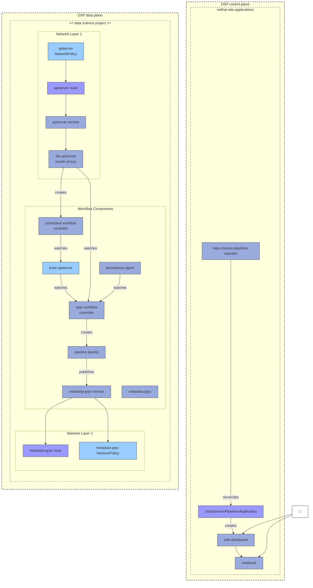

# Data Science Pipelines (DSP) v2 Architecture

## DSP Control Plane and Data Plane

## Architecture Overview

### Control Plane (redhat-ods-applications)

#### Components
- **data-science-pipelines-operator**: Operator that manages DSP lifecycle
- **DataSciencePipelinesApplication**: Custom resource defining pipeline application
- **odh-dashboard**: Web UI for managing pipelines
- **notebook**: Jupyter notebook environment for pipeline development

#### Flow
1. Operator reconciles DataSciencePipelinesApplication resources
2. DSP Application creates dashboard and notebook instances
3. Users interact through dashboard or notebook interfaces

### Data Plane (Data Science Project)

#### API Server Layer
- **apiserver NetworkPolicy**: Network policies controlling API access
- **apiserver route**: OpenShift route for external access
- **apiserver service**: Kubernetes service endpoint
- **kfp apiserver (oauth proxy)**: Kubeflow Pipelines API server with OAuth authentication

#### Workflow Management
- **scheduled workflow controller**: Manages scheduled pipeline executions
- **kube apiserver**: Kubernetes API server for resource management
- **argo workflow controller**: Orchestrates pipeline workflow execution
- **persistance agent**: Persists workflow state and metadata
- **pipeline (pod/s)**: Actual pipeline execution pods

#### Metadata Layer
- **metadata-grpc**: gRPC service for pipeline metadata
- **metadata-grpc-service**: Kubernetes service for metadata access
- **metadata-grpc route**: OpenShift route for metadata API
- **metadata-grpc NetworkPolicy**: Network policies for metadata access

## Data Flow

### Pipeline Creation
1. User creates pipeline via dashboard or notebook
2. Request flows through apiserver route → service → kfp apiserver
3. kfp apiserver creates scheduled workflow in workflow controller

### Pipeline Execution
1. Scheduled workflow controller watches for scheduled executions
2. Triggers argo workflow controller via kube apiserver
3. Argo workflow controller creates pipeline pods
4. Pipeline pods publish metadata to metadata-grpc service
5. Persistence agent watches workflows and stores state

### Metadata Access
1. Pipeline pods publish execution metadata
2. Metadata available via metadata-grpc-service
3. External access through metadata-grpc route
4. Network policies control metadata access

## Key Features

### Security
- OAuth proxy on API server for authentication
- NetworkPolicy resources for network segmentation
- Separate routes for API and metadata access

### Scalability
- Separate control and data planes
- Distributed workflow execution via Argo
- Persistent metadata storage

### Integration
- Dashboard integration for UI-based management
- Notebook integration for code-based pipeline development
- Kubeflow Pipelines API compatibility
