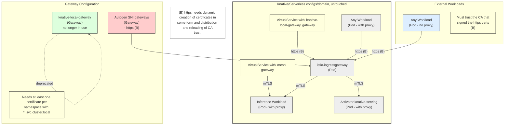

# KServe Autogen SNI Gateways Architecture

## Diagram 2: HTTPS with Autogen SNI Gateways

## Notes

- **HTTPS Communication**: Uses HTTPS (B) instead of mTLS for internal cluster communication
- **Dynamic Certificates**: Requires dynamic creation of certificates and distribution of CA trust
- **SNI Gateways**: Autogen SNI gateways replace the knative-local-gateway approach
- **Certificate Requirements**: Needs at least one certificate per namespace following pattern: `*.<namespace>.svc.cluster.local`
- **CA Trust**: Workloads must trust the CA that signed the HTTPS certificates
- **Deprecated**: The knative-local-gateway is no longer in use with this approach

