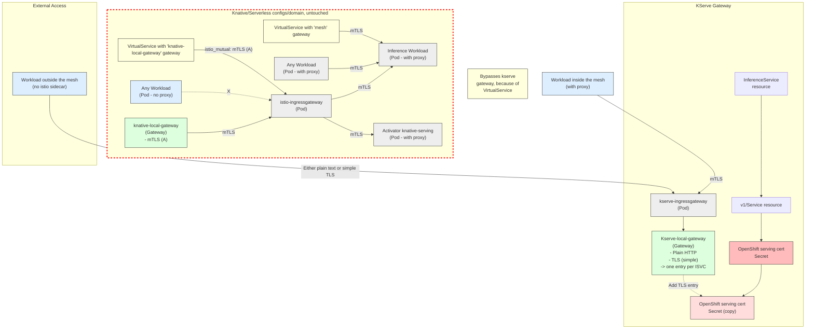

# KServe Private Network Architecture

## Diagram 1: mTLS with Local Gateway

## Notes

- **mTLS Communication**: Pods with proxy communicate using mutual TLS within the service mesh
- **Gateway Bypass**: VirtualService configuration allows workloads to bypass the kserve gateway
- **Certificate Management**: OpenShift serving certificates are copied and added as TLS entries to the gateway
- **Mixed Traffic**: Supports both plain text and TLS traffic from workloads outside the mesh

