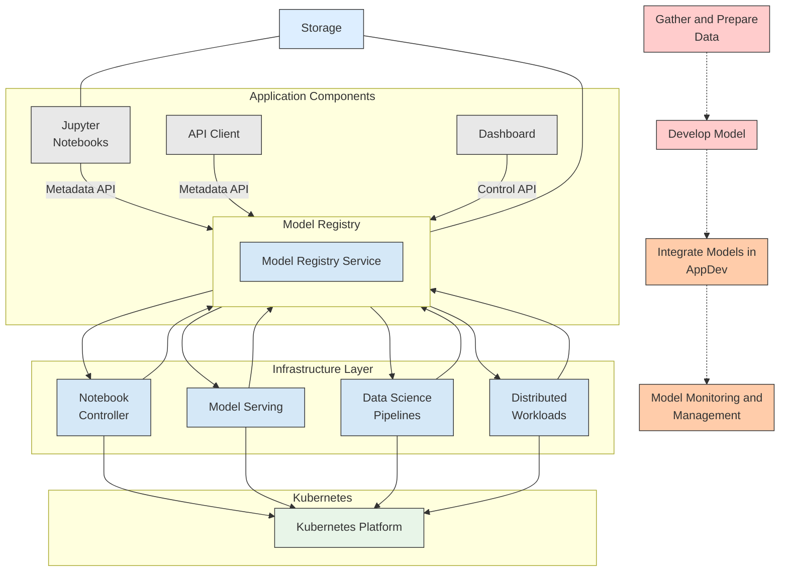

# Model Registry Architecture Overview

## ML Lifecycle and Model Registry Integration

## ML Lifecycle Phases

### 1. Gather and Prepare Data
- Initial phase of the ML workflow
- Data collection and preprocessing

### 2. Develop Model
- Model training and experimentation
- Jupyter Notebooks primary interface for data scientists
- Model metadata tracked in Model Registry

### 3. Integrate Models in AppDev
- Model deployment and integration
- Application developers consume models
- Dashboard provides UI for model management

### 4. Model Monitoring and Management
- Production model monitoring
- Performance tracking and management
- Continuous improvement feedback loop

## Architecture Layers

### Application Components Layer

#### User Interfaces
- **Jupyter Notebooks**: Primary interface for data scientists
  - Direct metadata API access to Model Registry
  - Used for model development and experimentation

- **API Client**: Programmatic access to models
  - Metadata API for model information retrieval
  - Integration with external applications

- **Dashboard**: Web-based management interface
  - Control API for administrative operations
  - Visual model registry management

### Model Registry Service
Central component that:
- Stores model metadata via Metadata API
- Provides model management via Control API
- Integrates with all infrastructure components
- Connects to persistent Storage

### Infrastructure Components

All infrastructure components integrate bidirectionally with Model Registry:

- **Notebook Controller**: Manages Jupyter notebook lifecycle
- **Model Serving**: Deploys and serves models in production
- **Data Science Pipelines**: Orchestrates ML workflows
- **Distributed Workloads**: Manages distributed training jobs

### Platform Layer
- **Kubernetes**: Underlying container orchestration platform
- All infrastructure components deployed on Kubernetes

## API Interfaces

### Metadata API
- Used by Jupyter Notebooks and API Clients
- Model metadata queries and updates
- Read-heavy operations for model information

### Control API
- Used by Dashboard
- Administrative operations
- Model lifecycle management

## Data Flow

### Model Development Flow
1. Data scientists work in Jupyter Notebooks
2. Models developed and trained
3. Metadata registered in Model Registry via Metadata API
4. Models stored in persistent Storage

### Model Deployment Flow
1. Dashboard or API Client queries Model Registry
2. Model Serving retrieves model information
3. Model deployed to Kubernetes infrastructure
4. Monitoring data flows back to Model Registry

### Integration Points
- **Storage**: Shared between Notebooks and Model Registry
- **Model Registry**: Central hub connecting all components
- **Kubernetes**: Common platform for all infrastructure services

## Key Benefits
- **Centralized Metadata**: Single source of truth for model information
- **Lifecycle Management**: Tracks models from development through production
- **Multi-Interface Access**: Supports notebooks, APIs, and dashboard
- **Platform Integration**: Native Kubernetes integration with ODH/RHOAI components
