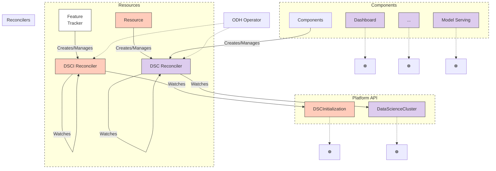

# ODH Operator Current Architecture

## Current Internal API Architecture

## Key Components

### Resources
- **Feature Tracker**: Manages feature-specific resources
- **Resource**: Generic resource management

### Reconcilers
- **DSCI Reconciler**: Reconciles DSCInitialization resources (Platform API)
- **DSC Reconciler**: Reconciles DataScienceCluster resources and Components

### Platform API
- **DSCInitialization**: Platform initialization configuration
- **DataScienceCluster**: Main cluster configuration

### Components
- **Dashboard**: User interface component
- **Model Serving**: Model serving infrastructure
- **Others**: Additional components indicated by ellipsis

## Architecture Notes

- Resources create and manage their respective reconcilers
- Reconcilers watch and react to changes in their associated platform resources
- Components are created and managed by the DSC Reconciler
- All components and resources ultimately interact with Kubernetes API (☸️)
