# ODH Operator Next Architecture

## Proposed Internal API Architecture

```mermaid
graph TB
    subgraph Resources["Resources"]
        FeatureTracker["Feature<br/>Tracker"]

        FeatureTracker -->|Creates| Reconciler1
    end

    subgraph Components["Components"]
        Dashboard1["Dashboard"]
        Ellipsis1["..."]
        ModelServing1["Model Serving"]
    end

    subgraph Reconcilers["Reconcilers"]
        DSCIReconciler["DSCI Reconciler"]
        DSCReconciler["DSC Reconciler"]
        DashboardReconciler["Dashboard<br/>Reconciler"]
        EllipsisReconciler["...<br/>Reconciler"]
        ModelServingReconciler["Mode Serving<br/>Reconciler"]

        DSCIReconciler -->|Watches| DSCIReconciler
        DSCReconciler -->|Watches| DSCReconciler
        DashboardReconciler -->|Watches| DashboardReconciler
        EllipsisReconciler -->|Watches| EllipsisReconciler
        ModelServingReconciler -->|Watches| ModelServingReconciler
    end

    subgraph ComponentsAPI["Components API"]
        Dashboard2["Dashboard"]
        Ellipsis2["..."]
        ModelServing2["Model Serving"]

        DashboardReconciler -->|Watches| Dashboard2
        EllipsisReconciler -->|Watches| Ellipsis2
        ModelServingReconciler -->|Watches| ModelServing2
    end

    subgraph PlatformAPI["Platform API"]
        DSCInitialization["DSCInitialization"]
        DataScienceCluster["DataScienceCluster"]

        DSCIReconciler -->|Watches| DSCInitialization
        DSCReconciler -->|Watches| DataScienceCluster
    end

    FeatureTracker -->|Creates<br/>Manages| Resource1["Resource"]

    DSCIReconciler -->|Creates<br/>Manages| Resource2["Resource"]
    DSCReconciler -->|Creates<br/>Manages| Resource3["Resource"]
    DashboardReconciler -->|Creates<br/>Manages| Resource4["Resource"]

    Dashboard1 -->|Creates<br/>Manages| DashboardReconciler
    Ellipsis1 -->|Creates<br/>Manages| EllipsisReconciler
    ModelServing1 -->|Creates<br/>Manages| ModelServingReconciler

    ODHOperator["ODH Operator"]
    ODHOperator -.-> Reconcilers

    Dashboard1 -.-> KubeIcon1["☸️"]
    Ellipsis1 -.-> KubeIcon2["☸️"]
    ModelServing1 -.-> KubeIcon3["☸️"]

    Dashboard2 -.-> KubeIcon4["☸️"]
    Ellipsis2 -.-> KubeIcon5["☸️"]
    ModelServing2 -.-> KubeIcon6["☸️"]

    DSCInitialization -.-> KubeIcon7["☸️"]
    DataScienceCluster -.-> KubeIcon8["☸️"]

    style FeatureTracker fill:#fff,stroke:#333
    style Dashboard1 fill:#acd,stroke:#333
    style Ellipsis1 fill:#acd,stroke:#333
    style ModelServing1 fill:#acd,stroke:#333
    style Dashboard2 fill:#acd,stroke:#333
    style Ellipsis2 fill:#acd,stroke:#333
    style ModelServing2 fill:#acd,stroke:#333
    style DSCIReconciler fill:#fcb,stroke:#333
    style DSCReconciler fill:#dce,stroke:#333
    style DashboardReconciler fill:#acd,stroke:#333
    style EllipsisReconciler fill:#acd,stroke:#333
    style ModelServingReconciler fill:#acd,stroke:#333
    style DSCInitialization fill:#fcb,stroke:#333
    style DataScienceCluster fill:#dce,stroke:#333
    style Resources stroke:#333,stroke-width:1px,stroke-dasharray: 5 5
    style Components stroke:#333,stroke-width:1px,stroke-dasharray: 5 5
    style ComponentsAPI stroke:#333,stroke-width:1px,stroke-dasharray: 5 5
    style PlatformAPI stroke:#333,stroke-width:1px,stroke-dasharray: 5 5
```

## Key Changes from Current Architecture

### New Components API Layer
- Introduces a dedicated **Components API** layer alongside Platform API
- Each component now has its own API resource (Dashboard, Model Serving, etc.)

### Enhanced Reconciler Pattern
- **Component-Specific Reconcilers**: Each component has a dedicated reconciler
  - Dashboard Reconciler
  - Model Serving Reconciler
  - Additional component reconcilers as needed

### Architecture Improvements
- **Better Separation of Concerns**: Components managed through dedicated API resources
- **Consistent Pattern**: All components follow the same watch/reconcile pattern
- **Resource Management**: Each reconciler creates and manages its own resources

### Component Lifecycle
1. Components create and manage their respective reconcilers
2. Reconcilers watch their corresponding Component API resources
3. Reconcilers create and manage Kubernetes resources
4. DSC Reconciler coordinates overall cluster state

## Benefits
- More modular and extensible architecture
- Clearer ownership and responsibility boundaries
- Easier to add new components following established pattern
- Better alignment with Kubernetes operator best practices
