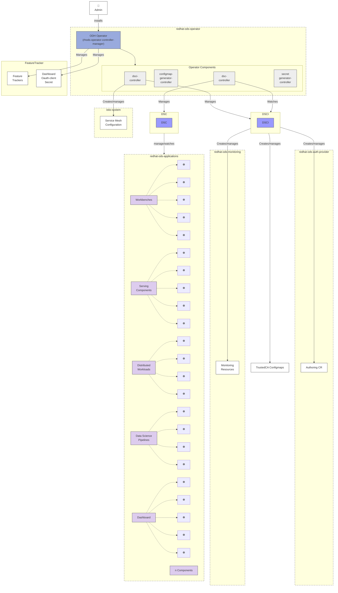

# Platform Architecture Overview

## RHOAI/ODH Platform Architecture

## Architecture Overview

### Admin Installation
- Administrator installs ODH Operator
- Operator deployed in **redhat-ods-operator** namespace

### ODH Operator Components

The operator consists of multiple controllers:

#### dsci-controller
- Manages DSCInitialization (DSCI) resources
- Creates and manages platform-level infrastructure:
  - Service Mesh Configuration (istio-system)
  - Authoring CR (redhat-ods-auth-provider)
  - Monitoring Resources (redhat-ods-monitoring)
  - TrustedCA Configmaps

#### dsc-controller
- Manages DataScienceCluster (DSC) resources
- Watches DSCI for platform readiness
- Manages application components in redhat-ods-applications

#### configmap-generator-controller
- Generates configuration for components

#### secret-generator-controller
- Manages secrets, including Dashboard OAuth client secret

### Platform Resources

#### Feature Tracker
- Cluster-wide resource tracking features
- Owner reference for resources linked to features
- Enables precise resource management and cleanup

#### Dashboard OAuth Secret
- Managed by operator
- Provides OAuth authentication for Dashboard

### Platform Infrastructure Namespaces

#### istio-system
- Service Mesh Configuration
- Network and security policies
- Managed by DSCI controller

#### redhat-ods-auth-provider
- Authoring CR for authentication
- OAuth and identity management
- Created by DSCI

#### redhat-ods-monitoring
- Monitoring Resources
- Metrics collection and alerting
- Managed by DSCI

### Application Components (redhat-ods-applications)

All components are managed by DSC controller and deploy Kubernetes resources (☸️):

#### Workbenches
- Jupyter notebooks and development environments
- Deploys 5+ Kubernetes resources

#### Serving Components
- Model serving infrastructure
- KServe, ModelMesh deployments
- Deploys 5+ Kubernetes resources

#### Distributed Workloads
- Ray, Kubeflow Training Operator
- Distributed computing resources
- Deploys 4+ Kubernetes resources

#### Data Science Pipelines
- Kubeflow Pipelines v2
- Workflow orchestration
- Deploys 4+ Kubernetes resources

#### Dashboard
- Web UI for platform management
- User-facing interface
- Deploys 5+ Kubernetes resources

#### Additional Components
- Feature Store, Model Registry, TrustyAI, etc.
- Extensible component architecture

## Control Flow

### Installation Flow
1. Admin installs ODH Operator
2. Operator controllers start in redhat-ods-operator namespace

### Platform Initialization Flow
1. DSCI controller watches for DSCInitialization CR
2. Creates platform infrastructure:
   - Service Mesh in istio-system
   - Auth provider in redhat-ods-auth-provider
   - Monitoring in redhat-ods-monitoring
   - TrustedCA Configmaps

### Application Deployment Flow
1. DSC controller watches for DataScienceCluster CR
2. DSC controller watches DSCI for readiness
3. Deploys and manages application components
4. Each component creates Kubernetes resources

## Key Design Principles

- **Namespace Isolation**: Different namespaces for operator, platform, and applications
- **Declarative Management**: CR-driven configuration (DSCI, DSC)
- **Resource Tracking**: FeatureTracker for precise lifecycle management
- **Layered Architecture**: Platform layer (DSCI) → Application layer (DSC)
