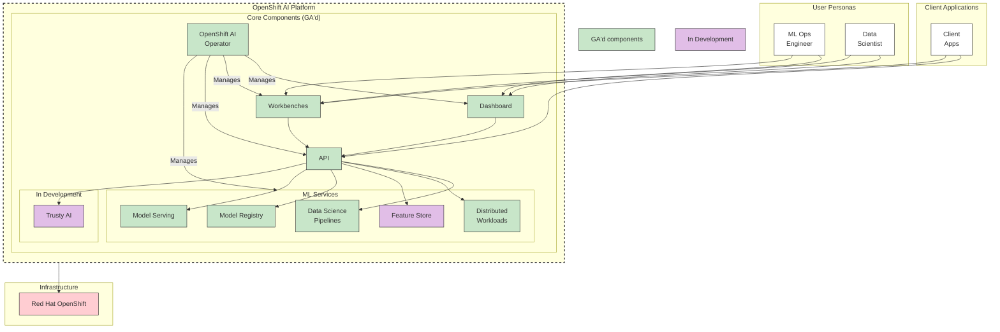

# RHOAI Components Overview

## OpenShift AI v2.13 Component Architecture

## User Personas

### ML Ops Engineer
- **Primary Interfaces**: Dashboard, Workbenches
- **Focus**: Infrastructure management, model deployment, operational monitoring
- **Activities**: Pipeline orchestration, distributed workload management, model serving

### Data Scientist
- **Primary Interfaces**: Dashboard, Workbenches
- **Focus**: Model development, experimentation, training
- **Activities**: Notebook development, model training, pipeline creation

## Component Layers

### Client Applications
- **Client Apps**: External applications and integrations
- **Access**: Direct API access and workbench integration

### Core Platform Components

#### OpenShift AI Operator
- Central management component
- Orchestrates all platform components
- Handles lifecycle management

#### Dashboard
- Web-based user interface
- Visual management and monitoring
- Connects to API for backend operations

#### Workbenches
- Jupyter notebook environments
- Interactive development interface
- Direct integration with ML services via API

#### API
- Central API gateway
- Unified interface to all ML services
- REST/gRPC endpoints

### ML Services (GA'd Components)

#### Data Science Pipelines
- Kubeflow Pipelines v2
- Workflow orchestration
- End-to-end ML pipeline management

#### Distributed Workloads
- Distributed training infrastructure
- Ray and Kubeflow Training Operator
- Multi-node job execution

#### Model Registry
- Model metadata management
- Version control and lineage tracking
- Integration across ML lifecycle

#### Model Serving
- Production model deployment
- KServe and ModelMesh support
- Inference endpoints

### In Development

#### Feature Store
- Feature engineering and management
- Feature versioning and serving
- Status: In Development

#### Trusty AI
- Model explainability
- Bias detection and monitoring
- Status: In Development

## Infrastructure

### Red Hat OpenShift
- Kubernetes platform
- Container orchestration
- Resource management and security

## Access Patterns

### User Access Flow
1. Users access via Dashboard or Workbenches
2. Dashboard/Workbenches communicate with API layer
3. API routes requests to appropriate ML services
4. Services execute on OpenShift infrastructure

### Client Application Flow
1. External apps connect via API
2. May also access Workbenches directly
3. API provides unified access to all services

### Operator Management Flow
1. Operator manages all component lifecycle
2. Monitors component health
3. Handles updates and configuration
4. Ensures platform consistency

## Component Maturity

### Generally Available (GA)
- OpenShift AI Operator
- Dashboard
- Workbenches
- API
- Data Science Pipelines
- Distributed Workloads
- Model Registry
- Model Serving

### In Development
- Feature Store (partial GA)
- Trusty AI

## Key Benefits

- **Unified Platform**: Single platform for complete ML lifecycle
- **Kubernetes-Native**: Built on OpenShift/Kubernetes
- **Modular Architecture**: Components can be used independently
- **Enterprise-Ready**: Operator-managed with enterprise support
- **Multi-Persona Support**: Serves both data scientists and ML ops engineers
